此篇教程是 R2 Admin Go 平台的「新增/编辑存储桶」的配置教程。

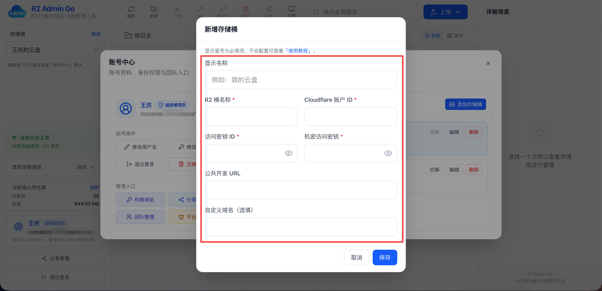

### 📝 配置步骤

**「显示名称」：** 存储桶的备注显示名称，并非 Cloudflare R2 存储桶的真实名称，显示在网站「存储桶」列表和，可自定义填写，例如：“我的网盘”、“项目资源盘”、“文件共享盘”、“图床盘”。

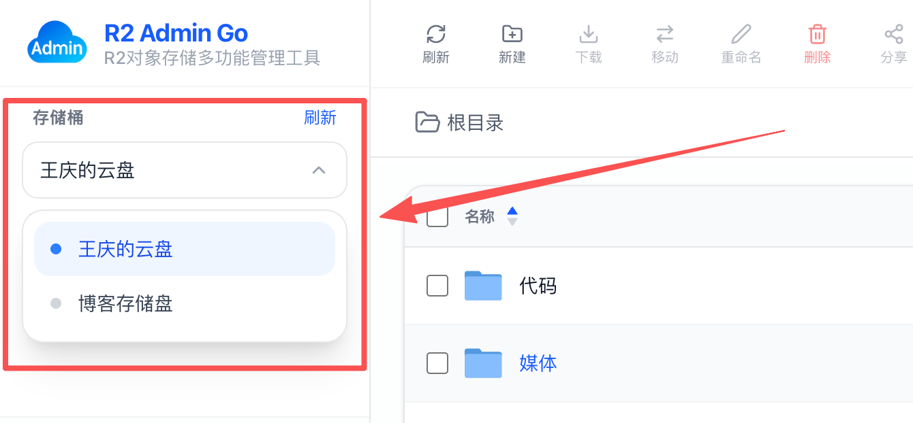

**「R2 桶名称」：** 你创建的 Cloudflare R2 的真实存储桶名称，具体查找步骤见下图所示，复制你需要配置的存储桶名称，返回 R2 Admin Go 平台粘贴输入即可。

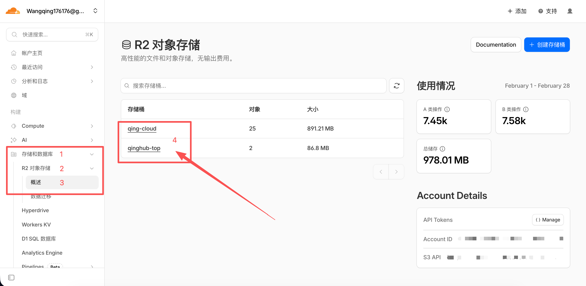

**「Cloudflare 账户 ID」：** 注册 Cloudflare 并登陆后，进入仪表盘页面，根据下方图片所示复制账户ID，返回 R2 Admin Go 平台粘贴即可。

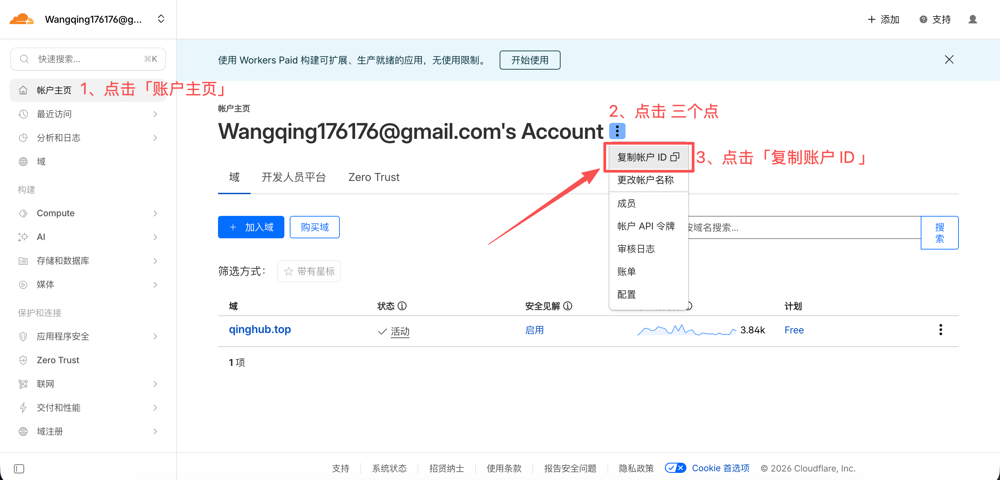

**「访问密钥 ID」、「机密访问密钥」：** 指 Cloudflare R2 的访问密钥 ID 和 机密访问密钥，需要在 Cloudflare 上进行简要设置：

1）进入 Cloudflare 仪表盘，点击「存储和数据库」→「R2 对象存储」→ 「概述」→「Manage」：

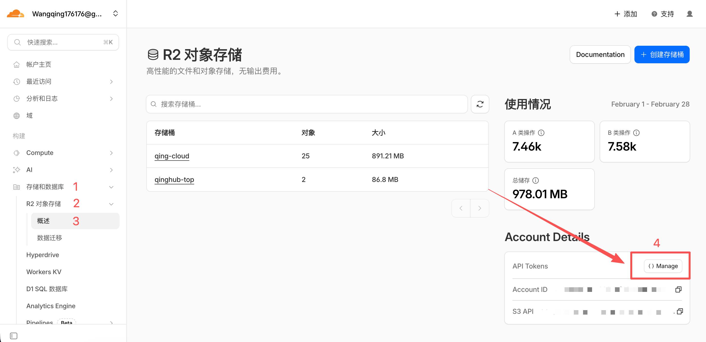

2）点击「创建 Account API 令牌」：

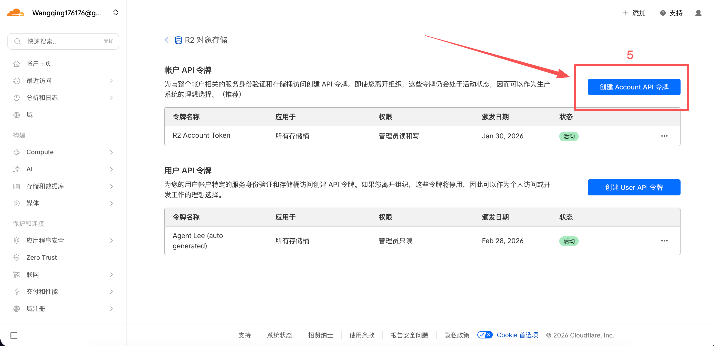

3）「令牌名称」可以自定义填写，「权限」需选择 ”管理员读和写“：

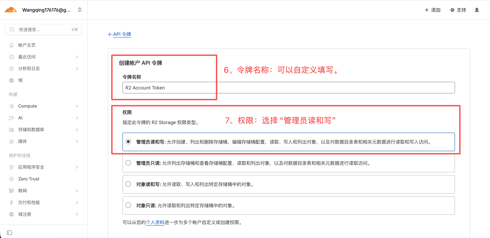

4）「TTL」选择永久，然后点击「创建 Account API 令牌」即可：

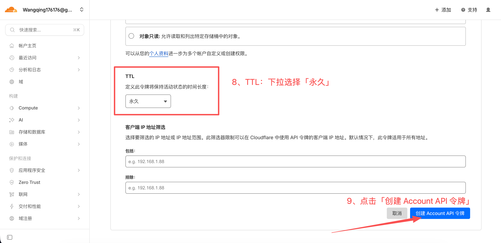

5）点击后向下滑动至「为 S3 客户端使用以下凭据」里面有「访问密钥 ID」和「机密访问密钥」信息，复制两项信息后返回 R2 Admin Go 平台粘贴即可。此页面只展示一次，建议截图妥善保存两项密钥信息。

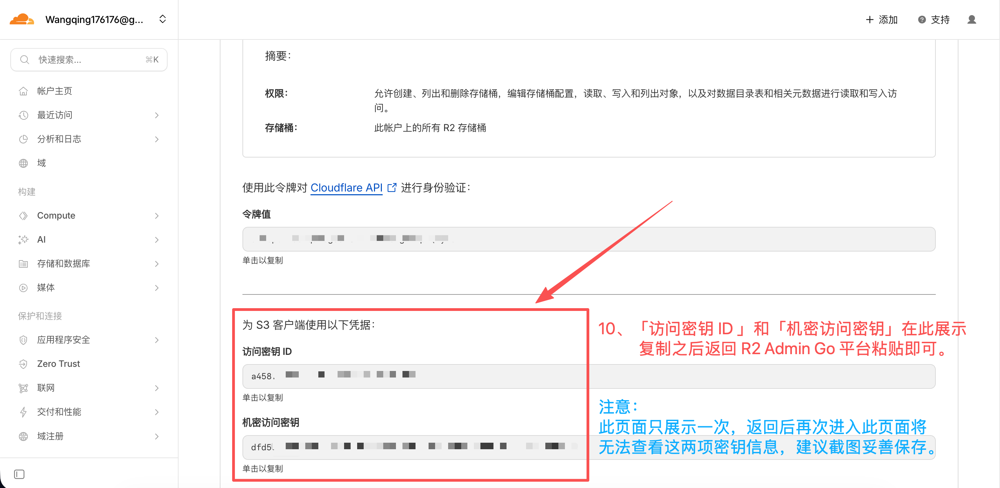

**「公共开发 URL」：** 点击刚刚输入「R2 桶名称」的存储桶 → 「设置」→ 「公共开发URL」→「启用」后就显示链接了，复制链接后返回 R2 Admin Go 平台后粘贴即可。

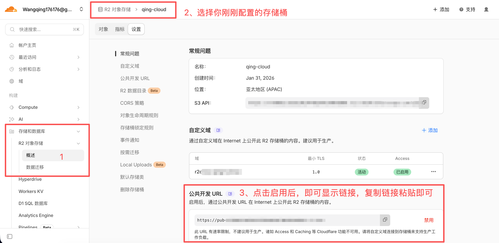

**「自定义域名」：** 如果你有自己的域名，可以填入，前提是在存储桶内配置好了自定义域并解析成功，此项选填，非必须填写。

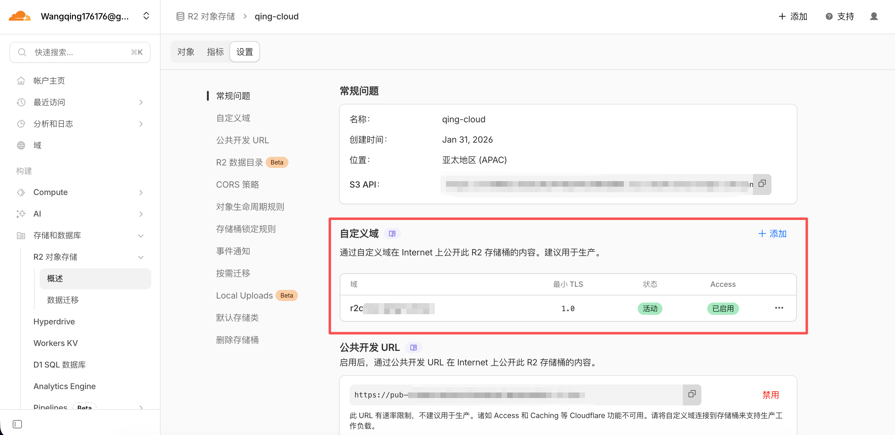

以上所有信息填写完毕后点击「保存」即可，等待添加完成并自动刷新完成后，即可对Cloudflare  R2 存储桶内的文件进行操作、预览、下载、上传、团队协作等。
