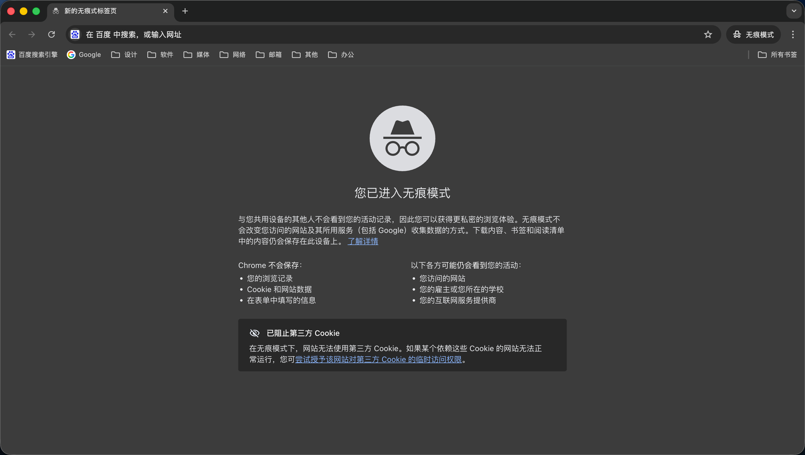

本篇文章说明  `qinghub.top` 站点在使用 Markdown 写作方面的说明以及常用功能代码模块。


## 🔐 文章访问密码

设置打开文章需要输入密码才可查看的代码，此代码弹窗样式已经配置在本站源代码后台，使用前需要将以下代码引用块放在需要设置密码的文章正文最前面，标题的后面。

更改双引号内的字符 `123456` 即可设置密码，不需要使用密码访问默认不需要添加。

```index.md

```

需要注意的是：由于本站为静态网站，此密码设置只是在前端，通过技术手段可能破解密码，重要涉密资料不建议使用此方法设置加密！


## 🏙️ 文章插入图片

在文章中插入图片直接拖入到文章即可，图片需要放在文章所在的文件夹下即可，但需要注意的是：务必将图片所在位置设置正确，否则图片无法加载，会显示裂开的图片图标。

在 `[  ]` 内可以输入图片的命名，不输入空白也是可以的；`（   ）`内输入图片所在GitHub的位置，将图片放在文章同文件夹内，输入图片的命名即可，需要注意的是，图片的拓展名仍需要输入。

**引用图片示例：**

```

```

**引用成功示例：**




## 🎞️ 引用内嵌视频

由于本站建设为 GitHub 部署于 Cloudflare 的静态网站，没有后台服务器，视频常规情况下不能存储在服务器内，采用引用第三方视频模块内嵌页面方法较为稳妥，这里以中国大陆本土视频平台 Bilibili哔哩哔哩 为例。

在文章内输入以下代码，视频链接 `src=` 引号内的链接替换为你想要的视频链接即可，输入好后自动适配页面宽度。

```
<div style="position:relative;padding-bottom:56.25%;height:0;overflow:hidden;border-radius:12px;">
  <iframe 
    src="https://player.bilibili.com/player.html?isOutside=true&aid=77876973&bvid=BV17J411q77r&cid=133231252&p=1"
    scrolling="no"
    border="0"
    frameborder="no"
    framespacing="0"
    allowfullscreen="true"
    style="position:absolute;top:0;left:0;width:100%;height:100%;">
  </iframe>
</div>
```

**引用成功示例：**

<div style="position:relative;padding-bottom:56.25%;height:0;overflow:hidden;border-radius:12px;">
  <iframe 
    src="https://player.bilibili.com/player.html?isOutside=true&aid=77876973&bvid=BV17J411q77r&cid=133231252&p=1"
    scrolling="no"
    border="0"
    frameborder="no"
    framespacing="0"
    allowfullscreen="true"
    style="position:absolute;top:0;left:0;width:100%;height:100%;">
  </iframe>
</div>

如果此方法失效，为哔哩哔哩技术调整，最稳定的方法是直接展示链接，让用户转移到外链观看，效果和稳定性是最佳的。示例：

```
> 本文配套演示视频已发布在 Bilibili  
> 点击下方链接跳转观看（推荐使用原站播放器）

👉 https://www.bilibili.com/video/BVxxxxxxxxx
```


## 💾 添加下载模块

本站 GitHub 后台已经配置了下载模块的样式，如果需要添加下载模块，直接在文章内引用代码块即可。

- 在 `title=` 引号内可以输入需要下载的文件名称。
- 在 `sub=` 引号内可以输入提示文字。
- 在 `url=` 引号内输入你的下载链接
- 在 `pass=` 引号内输入你的下载密码

**代码块如下：**

```

```

引用成功示例（密码：wang176176）：



需要注意的是：由于本站为静态网站，此密码设置只是在前端，通过技术手段可能破解密码，重要涉密资料不建议使用此方法设置加密！


## 📄 其他写作：

其他写作样式可使用 Markdown 本身的样式，这里推荐使用 Typora 软件，这款软件是一款非常不错的 Markdown 写作软件，写作可视化，像写 Word 文稿一样轻松简单。

由于 Markdown 写作代码过多，这里暂时不展示。


---


*后续如果有需要，我会随时添加内容在此文章下。*

*如有疑问或探讨，请在 关于 页面随时与我联系。*

